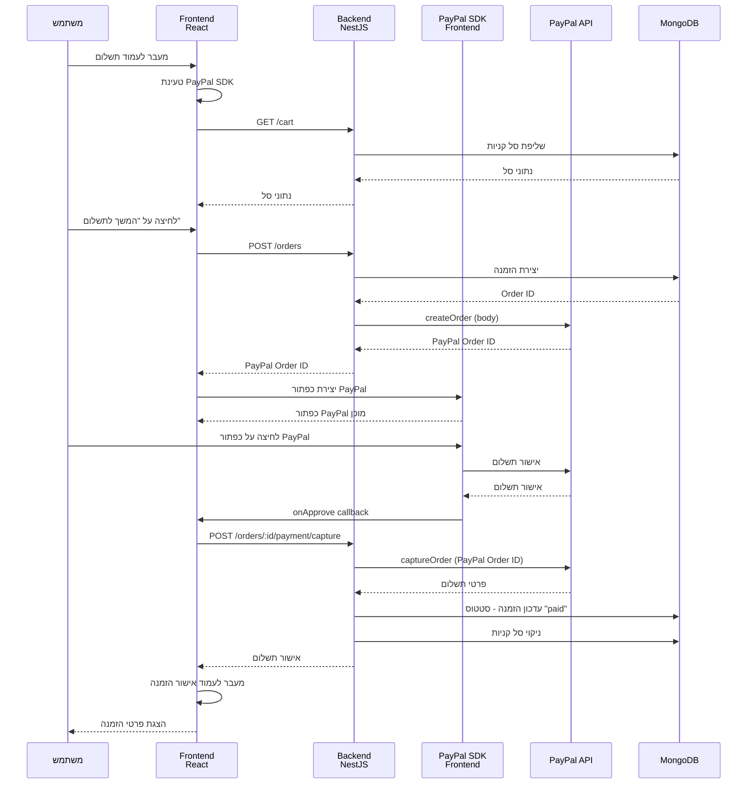
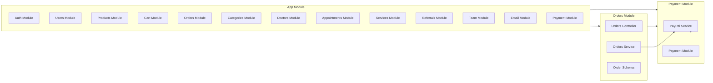
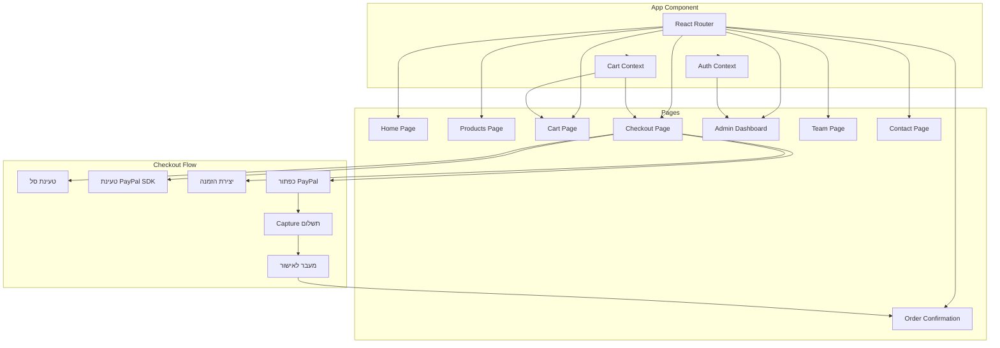
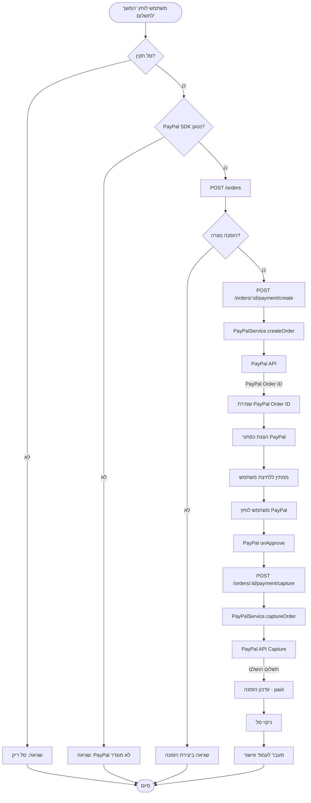
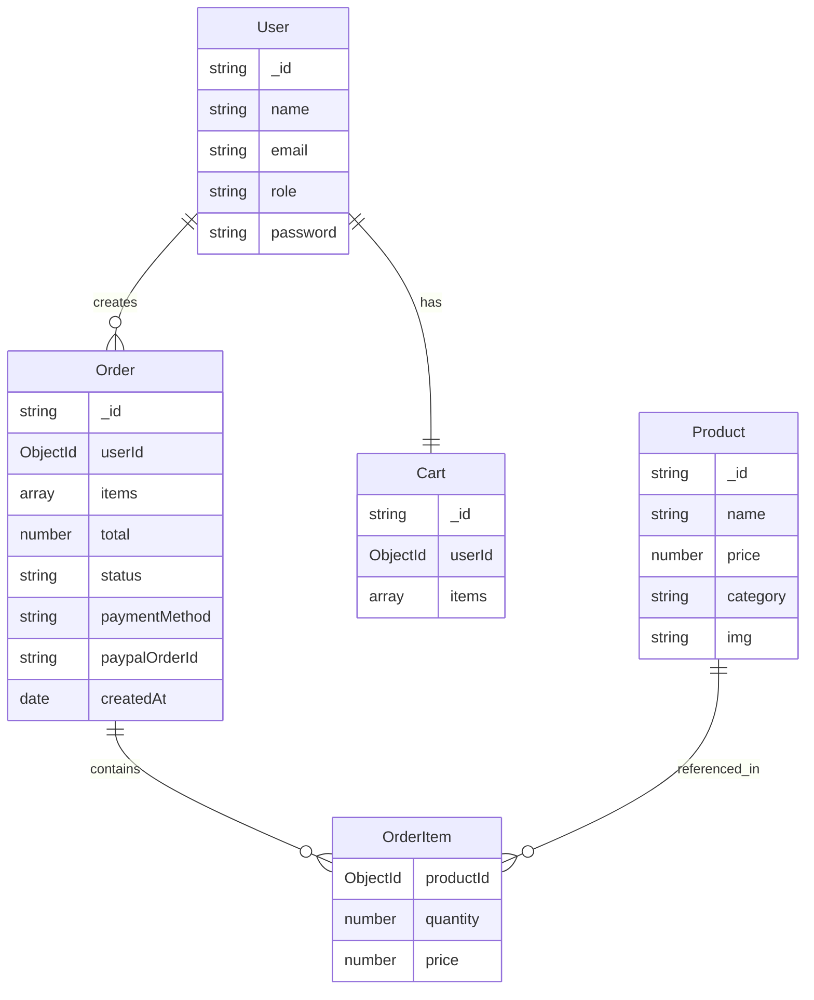
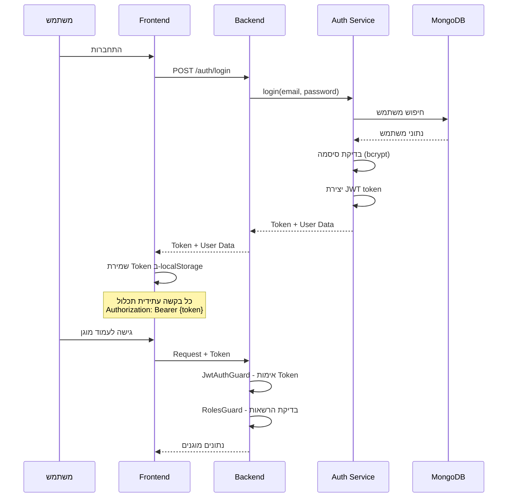
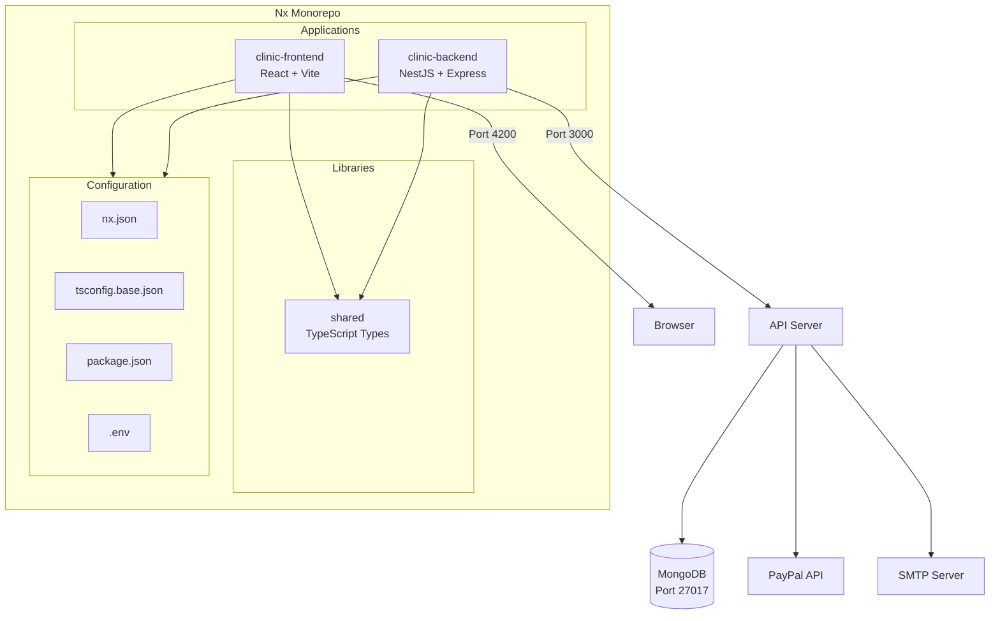

# ארכיטקטורת המערכת ותרשימי זרימה

## תרשים ארכיטקטורה כללי

```mermaid
graph TB
    subgraph Client[Frontend - React + Vite]
        UI[React Components]
        Router[React Router]
        Context[Context API]
        Axios[Axios HTTP Client]
    end
    
    subgraph Backend[NestJS Backend]
        Controllers[Controllers]
        Services[Services]
        Guards[Auth Guards]
        DTOs[DTOs]
    end
    
    subgraph Database[(MongoDB)]
        Users[(Users)]
        Products[(Products)]
        Orders[(Orders)]
        Cart[(Cart)]
        Doctors[(Doctors)]
        Team[(Team)]
        Referrals[(Referrals)]
    end
    
    subgraph External[External Services]
        PayPal[PayPal API]
        Email[SMTP Email]
    end
    
    UI --> Router
    Router --> Context
    Context --> Axios
    Axios -->|HTTP REST API| Controllers
    Controllers --> Guards
    Guards --> Services
    Services --> DTOs
    Services --> Database
    Services --> PayPal
    Services --> Email
    
    Database --> Users
    Database --> Products
    Database --> Orders
    Database --> Cart
    Database --> Doctors
    Database --> Team
    Database --> Referrals
```

## תרשים זרימת תשלום PayPal



## תרשים מבנה מודולים - Backend



## תרשים מבנה Frontend



## תרשים זרימת נתונים - יצירת הזמנה



## תרשים מבנה נתונים - Order



## תרשים אבטחה - Authentication Flow



## תרשים סביבת פיתוח - Nx Monorepo



---

## הערות על התרשימים

### ארכיטקטורה כללית
- **Frontend**: React 19 עם Vite, React Router, Context API
- **Backend**: NestJS עם Express, MongoDB, JWT Authentication
- **Database**: MongoDB עם Mongoose ODM
- **External Services**: PayPal API, SMTP Email

### זרימת תשלום PayPal
1. המשתמש מעבר לעמוד תשלום
2. טעינת PayPal SDK ב-Frontend
3. יצירת הזמנה ב-Backend
4. יצירת PayPal Order דרך PayPal API
5. הצגת כפתור PayPal
6. המשתמש מאשר תשלום ב-PayPal
7. Capture התשלום דרך PayPal API
8. עדכון הזמנה וניקוי הסל
9. מעבר לעמוד אישור

### אבטחה
- JWT Tokens לאימות משתמשים
- Role-based Authorization (admin/user)
- Password hashing עם bcrypt
- Guards להגנה על endpoints

### סביבת פיתוח
- Nx Monorepo לניהול הפרויקט
- Shared Library לטייפים משותפים
- Environment Variables לניהול הגדרות
- TypeScript לכל הקוד
